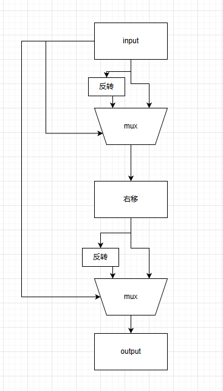

## Discussion Questions

1 How many gates does your one-bit multiplexer use? The 32-bit multiplexer? Write down a formula for an N-bit multiplexer.

```
one-bit multiplexer uses 4 gates.

32-bit multiplexer uses 128 gates.

N-bit multiplexer uses n*4 gates.
```

2 We wrote a polymorphic function implementing an N-bit multiplexer. Explain how to write a polymorphic version of the left shifter.

```bsv
Because left shifting involves adding zeros to the end of the data, we can remove the flag checks. Modify the calculation of the result as follows:

result = multiplexerN(shamt[0], operand, {operand[30:0], bitProvider(1'b0, 1)});
result = multiplexerN(shamt[1], result, {operand[29:0], bitProvider(1'b0, 2)});
...
```

3 One purpose of this lab was to demonstrate a microarchitectural optimization. How many gates did we save by combining the logical and arithmetic right shifts?

```
Implementing it separately requires 10 MUXes, while implementing it together requires 5 MUXes. Therefore, we save 5 MUXes, which amounts to 640 gates (5 * 32 * 4).
```

4 Our right shifter handles right shifts only. However, with a small extension, it can handle left shifts as well. Draw a microarchitecture for this kind of combined shifter. How much hardware do we save?



```
Combining the left shifter saves 5 MUXes, and combining the arithmetic right shifter and logical right shifter saves another 5 MUXes. In total, we save 10 MUXes, which amounts to 1280 gates (10 * 32 * 4).
```

